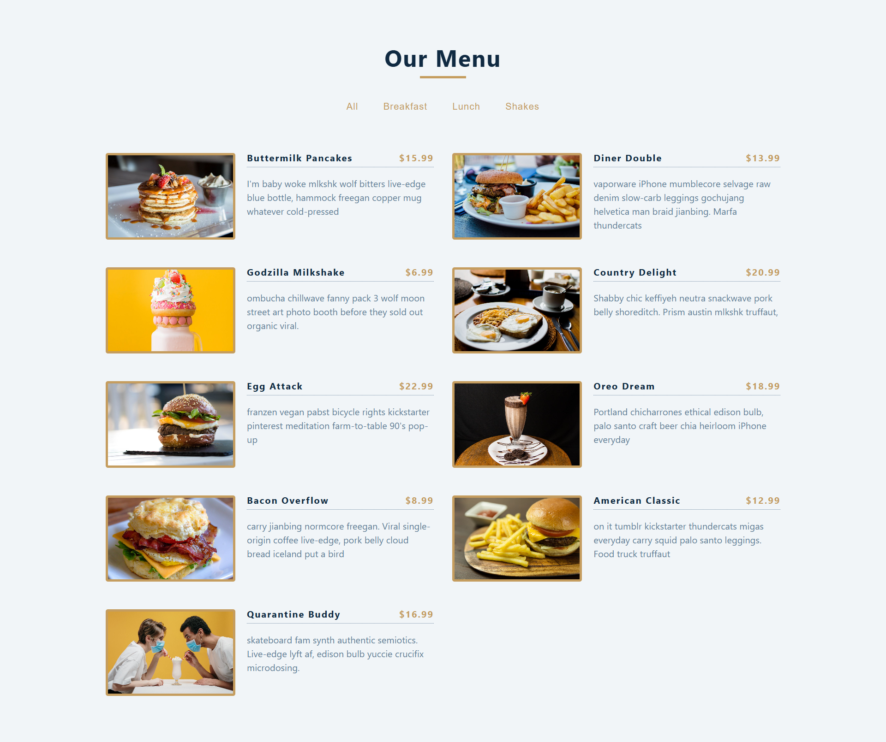

# Menu App

A React application that displays a food menu with filtering capabilities. Users can filter items by category (e.g., Breakfast, Lunch, Shakes).

## 📸 Screen

| Page | Preview |
| :--- | :--- |
| **Home Screen** |  |

---

## Features
- **Dynamic Categories**: Categories are generated dynamically from the data.
- **Filtering**: Filter menu items instantly by clicking on category buttons.
- **Responsive Design**: Works well on different screen sizes.

## Technologies Used

- React
- HTML
- CSS
- JavaScript

## Setup

1. Clone the repository:
   ```bash
   git clone https://github.com/aadhar41/menu-app.git
   ```

2. Navigate to the project directory:
   ```bash
   cd menu-app
   ```

3. Install dependencies:
   ```bash
   npm install
   ```

4. Run the development server:
   ```bash
   npm start
   ```

## Usage

- The application will start at `http://localhost:3000`.
- You can filter menu items by clicking on category buttons.
- The menu items will be dynamically generated based on the data provided.

---

## 🤝 Community & Contributions

Contributions are what make the open-source community such an amazing place to learn, inspire, and create. Any contributions you make are **greatly appreciated**.

- **Code of Conduct**: Please read our [Code of Conduct](CODE_OF_CONDUCT.md) to understand the standards of behavior we expect in our community.
- **Contributing**: Check out the [Contributing Guidelines](CONTRIBUTING.md) for details on our code of conduct and the process for submitting pull requests.
- **Security**: Please refer to our [Security Policy](SECURITY.md).
- **Issue Templates**: When opening an issue, please use the provided [Bug Report](.github/ISSUE_TEMPLATE/bug_report.md) or [Feature Request](.github/ISSUE_TEMPLATE/feature_request.md) templates.

---

## License

Distributed under the MIT License. See `LICENSE` for more information.

---

## Author

- [Aadhar gaur](https://github.com/aadhar41)

## Acknowledgments

- [React](https://reactjs.org/)
